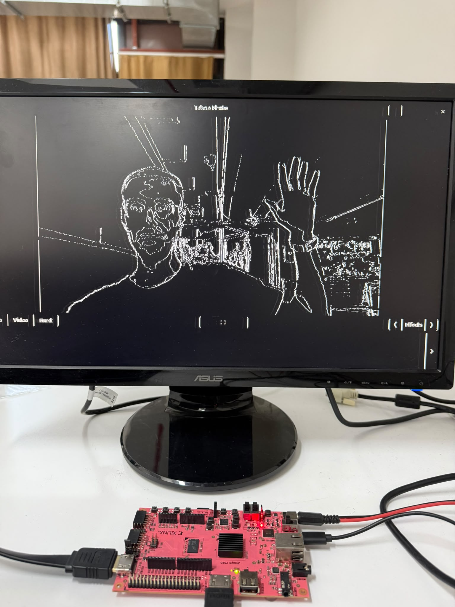
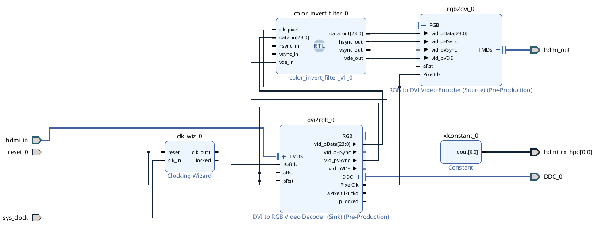

# PYNQ-Z2 Real-Time HDMI Video Processing

This repository contains a real-time hardware image processing project developed on the PYNQ-Z2 FPGA board. The system takes a live video stream from a computer via HDMI, processes the pixels in real-time using custom Verilog modules, and outputs the modified video to a monitor.

## Hardware Setup
* **Board:** PYNQ-Z2 (Zynq-7000 SoC)
* **Resolution:** 1280x720 at 60Hz
* **Inputs/Outputs:** HDMI RX (Input) and HDMI TX (Output)
* **IP Cores Used:** Digilent `dvi2rgb` (Decoder) and `rgb2dvi` (Encoder)
* **Clocking:** A 200 MHz reference clock is provided to the decoder to ensure a stable HDMI lock.

### Hardware Demonstration

## Project Phases

### Phase 1: HDMI Bypass System
Before applying any video effects, the first goal was to create a stable, delay-free video connection. In this phase, the HDMI input was decoded by the `dvi2rgb` IP, and the raw 24-bit RGB data and synchronization signals (HSYNC, VSYNC, VDE) were routed directly to the `rgb2dvi` encoder. 

This step was critical to verify the hardware connections, XDC pin constraints, and clock synchronization. Once the bypass was working without any screen noise or timing violations, the system was ready for custom hardware filters.

### Phase 2: 1D Edge Detection
After the bypass system was completed, a custom Verilog module was inserted between the decoder and the encoder. Since FPGAs process video as a continuous stream of pixels, the filtering is done on the fly without using frame buffers.

The edge detection module works in two main steps:

1. **Grayscale Conversion:** 
   To save hardware resources (like DSP slices), floating-point math is avoided. The RGB pixels are converted to grayscale using a simple bit-shift calculation: 
   `Grayscale = (R + 2G + B) / 4`
   This method is highly efficient for FPGA architecture.

2. **Edge Detection Logic:**
   The module uses a 1D (horizontal) edge detection logic. It stores the grayscale value of the previous pixel and compares it with the current pixel. If the brightness difference between two side-by-side pixels is greater than a certain threshold, the hardware identifies it as an edge and outputs the color white. If the difference is low, it outputs black. 

### Preventing Timing Violations
To prevent screen noise and timing issues at 74.25 MHz pixel clock, the Verilog code uses a basic pipeline design. The input signals, mathematical calculations, and output signals are registered at different clock cycles. This ensures that the data is processed smoothly without signal traffic.

## System Architecture
The following block design shows how the IPs and the custom Verilog filter module are connected in Vivado:

## Repository Contents
* `color_invert_filter.v`: The main Verilog module that contains the grayscale and edge detection logic.
* `block_design.png`: A screenshot of the Vivado block design showing how the IPs and the custom module are connected.
* `.xdc` file: The physical pin constraints for the PYNQ-Z2 board.